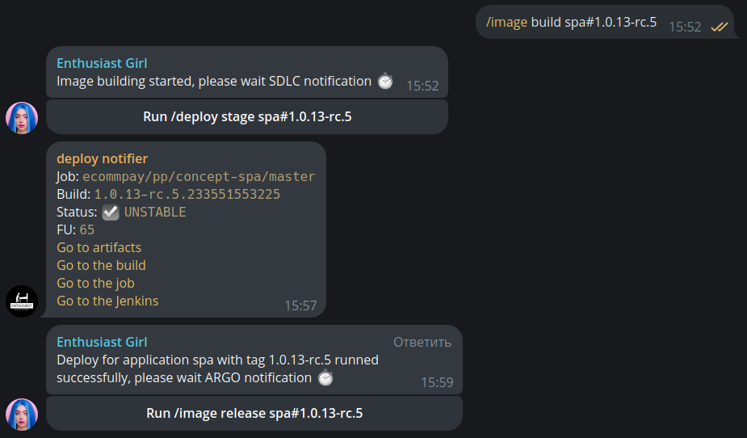

### Enthusiast girl bot

Created to simplify the deployment process using a telegram bot

## Example

## Build image
1. `docker build -t enthusiast_girl:latest .`
2. `docker tag enthusiast_girl:latest quay.ecpdss.net/k_popov/enthusiast_girl:0.0.8`
3. `docker push quay.ecpdss.net/k_popov/enthusiast_girl:0.0.8` 

Provide registry credentials if required using `docker login`

## Run image
1. Ensure that your user has private key which needed for stash connection establishment
2. Run using docker swarm: `docker stack deploy -c docker-compose.yaml girl`